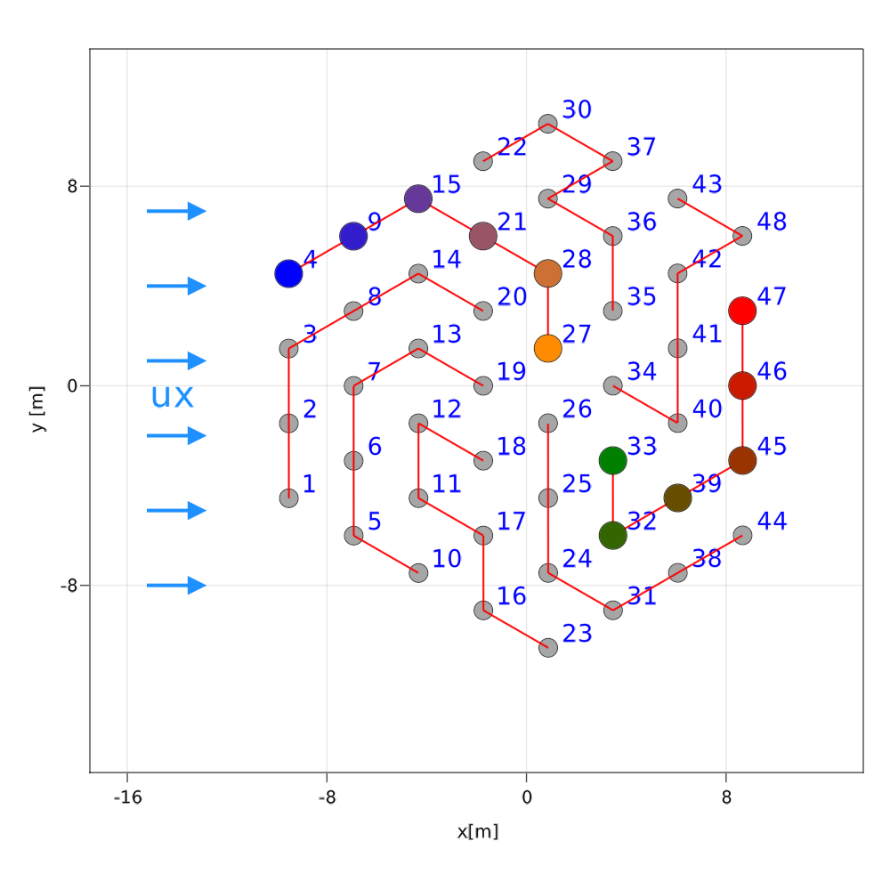
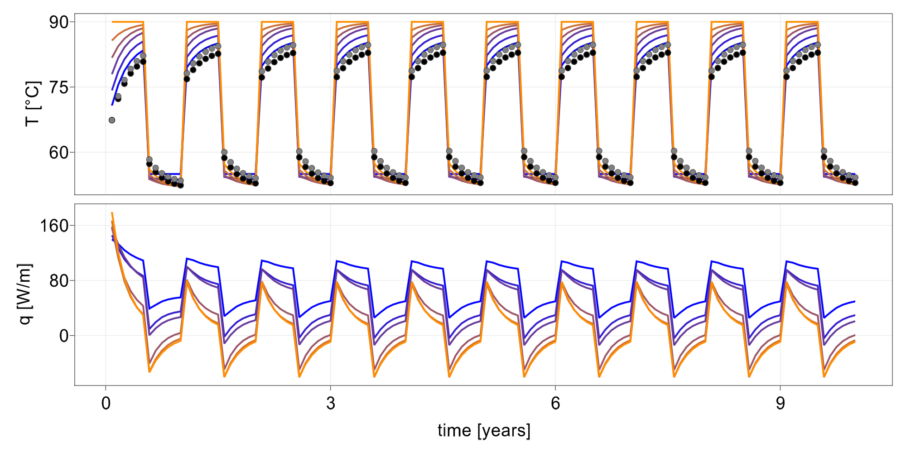
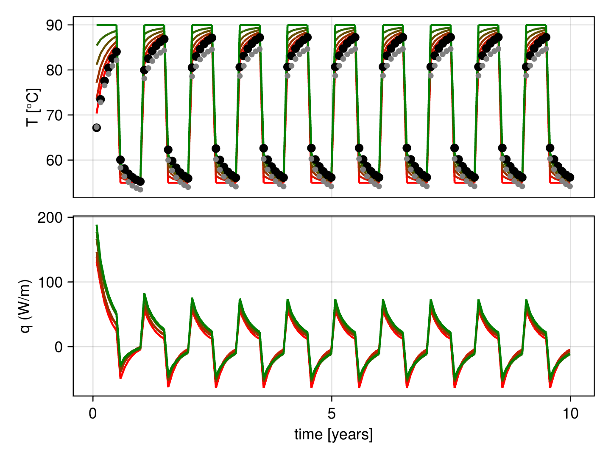
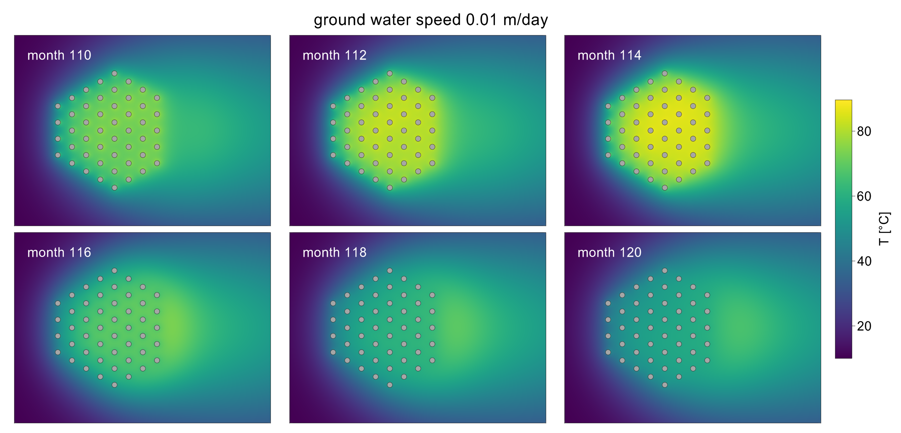

# BoreholeNetworksSimulator

This package implement an example of simulation of a Borehole Thermal Energy Storage where the storage volume is affected by regional ground water movement. 


## Initial Set-up
Simply clone the project using e.g. git clone, cd to the project directory, enter the pkg manager shell mode using the `]` key and type following two commands.
```
(v1.5.4) pkg> activate .

(BoreholeNetworksSimulator) pkg> instantiate 
```

## Run the example
```
julia > include("examples/example1/sim1.jl") 
```

## The model 
The example considers a borehole field of 48 boreholes connected according to scheme utilized in the installation in Braedsturp, Denmark. 



## Results

Inlet borehole temperatures and heat flows for boreholes along two branches in the borehole field. The time series are color coded according to the previous configuration plot above. In addition to the inlet temperature, the output temperature from the branch (grey dot), and the mean output temperature from the field (black dot) are displayed.





Finally we can display the heatmap of the temperature field in the borehole region during the 10th year of operation


