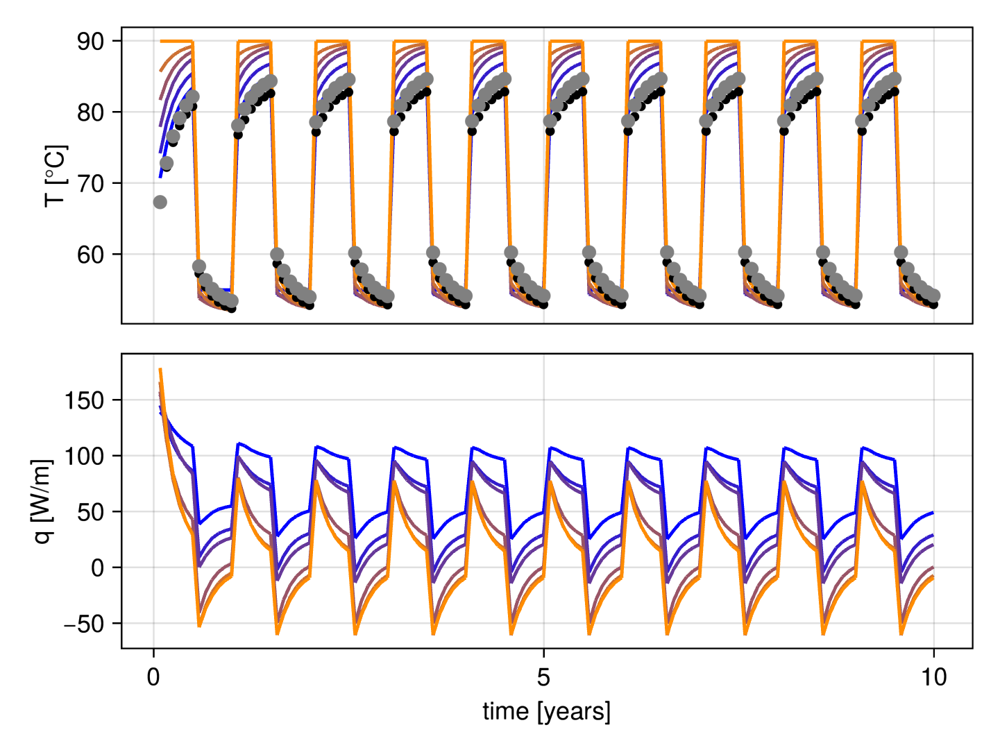

[](https://github.com/JuliaTesting/Aqua.jl)
[](https://github.com/marcbasquensmunoz/BoreholeNetworksSimulator.jl/actions/workflows/testing.yml?query=branch%3Amain)

[](https://marcbasquensmunoz.github.io/BoreholeNetworksSimulator.jl/dev/)


# BoreholeNetworksSimulator

This package implements a borehole network simulation tool featuring a modular architecture that allows to choose among several models, system configurations and constraints options.

## Initial Set-up
Simply clone the project using e.g. git clone, cd to the project directory, enter the pkg manager shell mode using the `]` key and type following two commands.
```
(v1.10) pkg> activate .

(BoreholeNetworksSimulator) pkg> instantiate 
```

## Example
The example considers a borehole field of 48 boreholes connected according to scheme utilized in the installation in Braedsturp, Denmark. 


## Run the example
```
include("examples/modular/main.jl")
```
In this example, the simulation is executed and the results are saved in the cache file named 'cache_3.1536e8.jld2'. The result data is also available in memory:
```
julia> containers.X
192×120 Matrix{Float64}:
  70.8847   75.0666   77.993    79.8948   81.1608  …  55.0      55.0      55.0      55.0
  67.5464   71.9367   75.0863   77.1524   78.5424     54.0451   53.9479   53.8829   53.8375
  74.3405   78.1643   80.7556   82.4294   83.5353     54.0451   53.9479   53.8829   53.8375
  70.8847   75.0666   77.993    79.8948   81.1608     53.3751   53.162    53.0222   52.9267
  78.015    81.4475   83.6781   85.1081   86.0436     53.3751   53.162    53.0222   52.9267
   ⋮                                               ⋱                                
 166.095   -45.855   -26.2117  -19.1312  -14.2904      8.85064   6.64457   5.00616   3.79414
 176.965   -50.0092  -28.9111  -21.2066  -15.7431      8.59637   6.57639   4.9994    3.79898
 187.948   -55.3887  -30.2105  -21.656   -15.8568  …   7.91946   6.12587   4.71477   3.6243
 179.911   -47.192   -24.6851  -18.3117  -13.8542      6.52704   5.39342   4.38165   3.54095
```

## Plots
Plots showing the results of the simulation as also available
```
julia > include("examples/plots/sim1.jl") 
```

Inlet borehole temperatures and heat flows for boreholes along two branches in the borehole field. The time series are color coded according to the previous configuration plot above. In addition to the inlet temperature, the output temperature from the branch (grey dot), and the mean output temperature from the field (black dot) are displayed.




Finally we can display the heatmap of the temperature field in the borehole region during the 10th year of operation


## Running the code in Python
Julia is interoperable with Python, making it possible to run this code from Python. In order to so do, install the Python module `juliacall` and run 
```
python3 examples/modular/main.py
```
This script calls the same code as the `main.jl`.
