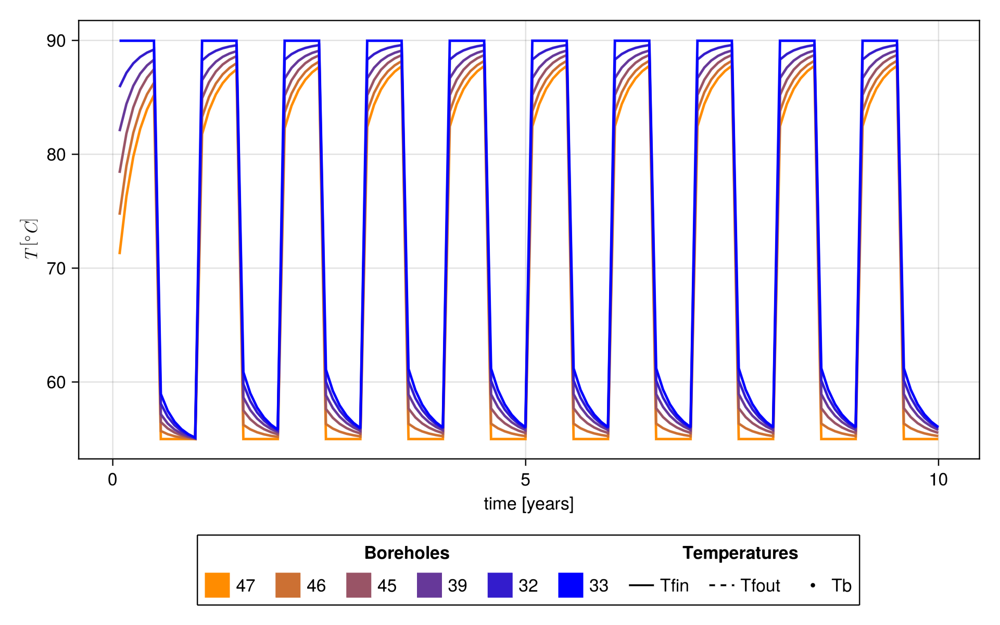

# Example: Braedstrup borefield 

The example considers a borehole field of 48 boreholes connected according to scheme utilized in the installation in Braedstrup, Denmark. 
The source code of this example can be found in `examples/Braedstrup/main.jl`.
The field is in a porous medium with an underground water flow of ``0.01 \frac{m}{\text{day}}``, which we assume to be in the ``x`` direction. 
The borefield consists of 8 branches, each branch in parallel, and within each branch there are ``6``boreholes in series. 
The positions and connections are represented in the following plot: 


During the summer, heat is injected in the field with a fluid at a constant temperature of ``90°C`` through all the branches from the center of the field. During the winter, heat is extracted by circulating the fluid at a temperature of ``55°C`` from the external end of each branch and collected at the center.
The simulation is done with a monthly time step duting `10` years.

## Run the example
```
include("examples/Braedstrup/main.jl")
```
The elapsed times for the precomputation and computation phases are:
```
2.449359 seconds (570.20 k allocations: 109.171 MiB, 0.66% gc time)
0.140535 seconds (255.75 k allocations: 49.735 MiB, 62.17% compilation time: 100% of which was recompilation)
``` 

We can extract the result of the simulation 
```
julia> containers.X
192×120 Matrix{Float64}:
  192×120 Matrix{Float64}:
  90.0      90.0      90.0     90.0     90.0     …   54.1785   53.5253   53.0836   52.7797
  85.7196   86.3321   86.6953  86.9358  87.1041      53.3354   52.6224   52.1367   51.7994
  85.7196   86.3321   86.6953  86.9358  87.1041      54.8461   54.2727   53.8868   53.6232
  81.7574   83.051    83.8273  84.3361  84.6863      54.1785   53.5253   53.0836   52.7797
   ⋮                                             ⋱                                
 153.897   118.897    93.5639  74.8265  60.7942     -27.2873  -20.0578  -14.7582  -10.8234
 144.883   112.083    87.7717  69.5736  55.8771     -29.8091  -21.8784  -16.1027  -11.856
 136.767   108.025    86.4461  69.9911  57.3688  …  -28.6089  -20.7213  -15.0661  -10.9335
 149.022   124.549   105.729   90.6145  78.3994     -22.1191  -15.7456  -11.0385   -7.4812
```

## Plots

In order to visualize the results, we can use the subpackage `BNSPlots`. For more details, refer to `[Visualizing the result with BNSPlots](@ref)`.


Inlet borehole temperatures and heat flows for boreholes along two branches in the borehole field. The time series are color coded according to the previous configuration plot above. In addition to the inlet temperature, the output temperature from the branch (grey dot), and the mean output temperature from the field (black dot) are displayed.




Finally we can display the heatmap of the temperature field in the borehole region during the 10th year of operation


## Running the code in Python
The example is also avaiable from Python. For details of how this is done refer to [Running BoreholeNetworksSimulator from Python](@ref). 
The Python version is in:
```
examples/Braedstrup/main.py
```
